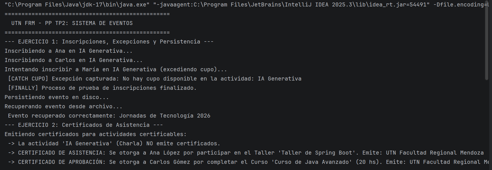
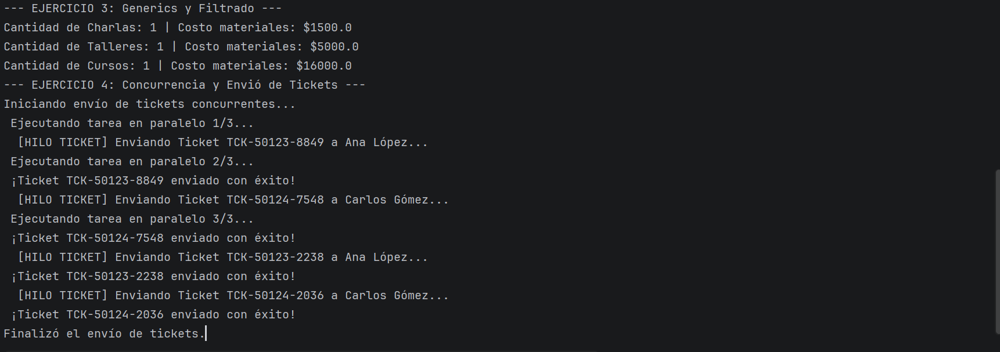

# Trabajo Práctico N° 2 - Paradigmas de Programación (UTN FRM)

**Alumno:** Ramiro Gonzalez  
**Legajo:** 53380  
**Carrera:** Ingeniería en Sistemas de Información  
**Universidad:** Universidad Tecnológica Nacional - Facultad Regional Mendoza  
**Año:** 2026

